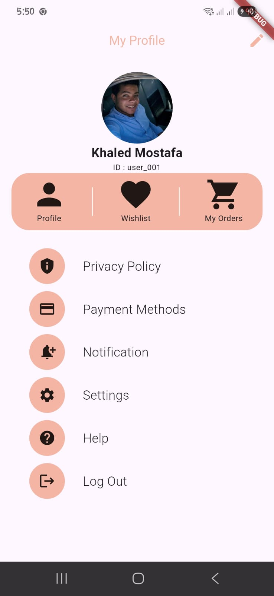
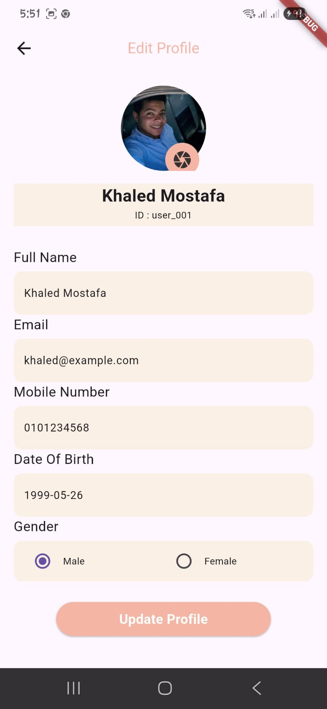
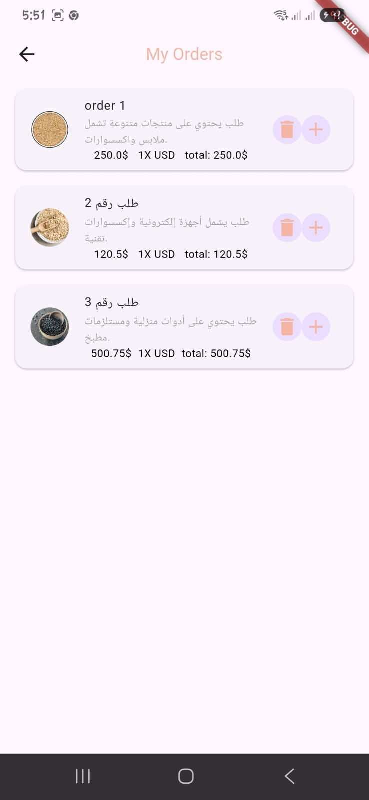

# Flutter Profile & Orders App

A simple Flutter application to view and edit user profile information and display previous orders. Built using:

✅ **GetX** for state management and navigation  
✅ **Firebase Realtime Database** for backend data storage  
✅ **Image Upload** functionality for profile pictures  
✅ **Previous Orders List** with images and descriptions  

---

## ⚙️ Requirements

- Flutter 3.x.x  
- Firebase Realtime Database setup  
- `get` package for state management  
- `image_picker` package for image selection  
- Proper Firebase initialization  

---

## 🚀 Getting Started

```bash
flutter pub get
flutter run

## 🖥️ Features

✔ View user profile: name, phone, email, birth date, gender, and profile picture  
✔ Edit profile information with live updates to Firebase  
✔ Pick or capture a profile image and upload to Firebase  
✔ Display a list of previous orders with image, description, date, and total amount  
✔ Clean, reusable widget structure  
✔ GetX for efficient state management and navigation  

---

## 🧩 Tech Stack

- Flutter  
- GetX  
- Firebase Realtime Database  
- Image Picker  
- NetworkImage for displaying images  

---

## 🔥 Firebase Setup

1. Create a Firebase project  
2. Add `google-services.json` (Android) or `GoogleService-Info.plist` (iOS)  
3. Enable Realtime Database  
4. Set temporary open database rules for testing (optional):

```json
{
  "rules": {
    ".read": "true",
    ".write": "true"
  }
}


## 📸 Preview

<p align="center">
  
  
  
</p>

